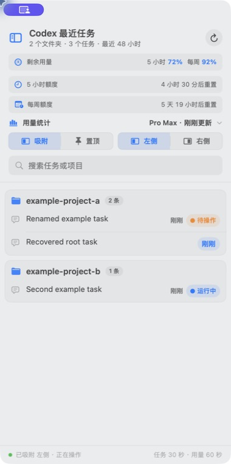
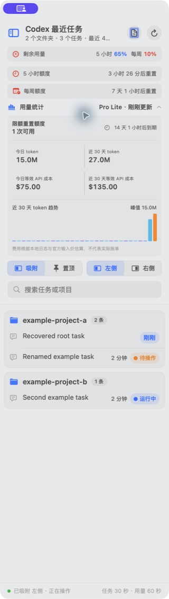
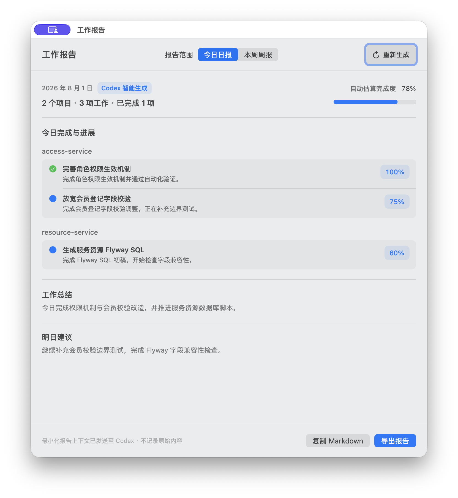

# Codex 最近任务栏

[简体中文](README.md) | [English](README.en.md)

一个原生 macOS 菜单栏工具，用于在 ChatGPT / Codex 桌面端旁边查看最近活跃的 Codex 任务、任务状态和用量信息。

应用按项目目录整理最近 48 小时的任务，支持精确跳转、左右吸附、独立置顶、项目快捷操作和窗口宽度预设。它不会修改 Codex 数据，也不会上传任务内容。

> 这是非 OpenAI 官方项目。目前支持 macOS 13 及以上版本，并在 Apple Silicon Mac 上完成验证。

## 界面预览

| 最近任务与窗口控制 | 展开的用量统计 |
| --- | --- |
|  |  |

### 智能工作报告



> 三张截图均由仓库 QA 固定数据生成，不包含真实任务、项目路径或账号用量。

## v1.5.1 更新摘要

- 新增 Codex 智能日报与周报，支持一句话成果、完成度、工作总结、后续建议和 Markdown 导出。
- 报告窗口打开或切换日报/周报时不会自动生成，只有明确点击“生成报告”后才读取所选时间范围内的脱敏上下文。
- 生成过程显示当前阶段、估算进度和已用时间，Codex 不可用时回退到本地摘要。
- 完善用量统计、额度重置时间、账号方案显示、诊断日志与数据库重试。
- 优化吸附/置顶控件、左右吸附、项目快捷操作和窗口宽度预设。

## 主要功能

### 最近任务

- 按真实项目目录分组，按最近活动时间倒序排列。
- 显示最近 48 小时的顶层任务，排除归档任务和内部子任务。
- 显示“运行中”“待操作”“待查看”和最后活动时间。
- 任务名称更新后，会在下一次刷新时同步。
- 单击任务，通过唯一 Thread ID 精确打开对应 Codex 任务。
- 支持搜索任务或项目。

### 项目快捷操作

右键单击任务可执行：

- 复制项目路径
- 在 Finder 打开项目
- 在终端打开项目

“在终端打开项目”使用 macOS 自带的 Terminal，并直接定位到项目目录。

### 自动日报与周报

- 从侧边栏标题区或菜单栏打开独立的“工作报告”窗口。
- 自动按今天或本周筛选任务，并按项目分组。
- 以用户提出的需求为主、助手处理结果为证据，由 Codex 归纳每条工作的一句话成果和完成度。
- 自动生成工作总结及下一工作日/下周建议。
- 生成过程中显示当前阶段、估算百分比和已用时间；模型返回完整结果前不会显示 100%。
- 支持复制 Markdown 或导出 `.md` 文件。

打开报告窗口或切换日报/周报时不会自动生成；只有用户明确点击“生成报告”或“重新生成”后才会开始。应用会裁剪所选日期范围内的用户需求和助手结论，移除工具记录、代码块、绝对路径及明显密钥，再通过临时的 Codex 非交互进程生成结构化报告。Codex 不可用、超时或返回格式异常时，自动回退到本地快速摘要。

### 窗口与 ChatGPT 联动

- 在一行内切换“吸附 / 置顶”；吸附时可继续选择“左侧 / 右侧”。
- 吸附模式会跟随 ChatGPT 窗口移动、缩放、前后台切换、最小化和恢复。
- 当首选侧空间不足时，会优先切换到另一侧，避免覆盖 ChatGPT 或跑到其他屏幕。
- 置顶模式可独立移动，并保持在其他应用上方。
- 菜单栏可快速切换窄、中、宽三种窗口宽度。
- 应用只显示在 macOS 菜单栏，不占用 Dock。

### 用量信息

- 保留官方剩余用量百分比。
- 显示可用额度窗口的重置时间；如果官方未返回 5 小时窗口，则只显示每周额度。
- 显示账号方案，例如 Plus、Pro、Pro Lite 或 Pro Max。
- 可展开查看近 30 天 token 趋势、等效 API 成本估算、限额重置额度和最常用模型。
- 官方日统计可能延迟一天；没有当日数据时，界面会明确显示最近一个可用日期。
- 成本仅按官方模型输入价格估算，不是实际账单。

任务列表和用量信息相互独立。用量服务暂时不可用时，最近任务仍可正常使用。

## 下载与安装

从 [Releases](https://github.com/fenghlkevin/codex-recent-tasks-sidebar/releases) 下载最新的 macOS 压缩包，解压后将 `CodexRecentTasksSidebar.app` 移到 `/Applications`。

首次使用吸附和窗口跟随功能时，请在：

`系统设置 > 隐私与安全性 > 辅助功能`

允许“Codex 最近任务”控制电脑。应用采用 ad-hoc 签名且未经过 Apple 公证，首次打开时可能需要在“隐私与安全性”中确认。

## 从源码构建

要求：

- macOS 13 或更高版本
- Xcode Command Line Tools
- 已安装并使用过 ChatGPT / Codex 桌面端

```bash
git clone https://github.com/fenghlkevin/codex-recent-tasks-sidebar.git
cd codex-recent-tasks-sidebar
./scripts/qa.sh
open build/CodexRecentTasksSidebar.app
```

`./scripts/qa.sh` 会构建并验证应用。产物位于：

```text
build/CodexRecentTasksSidebar.app
```

确认本地版本符合预期后，可手动替换 `/Applications/CodexRecentTasksSidebar.app`。构建脚本不会自动覆盖现有应用。

## 跟随 ChatGPT 启动

应用本身不会在系统登录时主动显示。仓库提供的 [`scripts/watch-chatgpt.sh`](scripts/watch-chatgpt.sh) 可交给 macOS LaunchAgent 定期执行：

- 只有检测到 `/Applications/ChatGPT.app` 的主进程时才启动侧边栏。
- 不会把 Codex 后台辅助进程误判为 ChatGPT 主窗口。
- ChatGPT 未运行时不会打开侧边栏。
- ChatGPT 退出后，侧边栏会自行退出。

脚本假设应用安装在：

```text
/Applications/CodexRecentTasksSidebar.app
```

LaunchAgent 属于可选配置，不影响手动启动。若旧配置设置了 `RunAtLoad`，脚本也会先检查 ChatGPT 主进程，因此不会在登录时直接显示窗口。

## 菜单栏

单击菜单栏图标可使用：

- 显示侧边栏
- 工作报告
- 刷新
- 请求辅助功能权限
- 窗口宽度：窄 / 中 / 宽
- 退出

## 数据来源与隐私

应用只读访问本机 Codex 数据：

- `~/.codex/state_5.sqlite` 或兼容数据库位置
- `~/.codex/session_index.jsonl`
- `~/.codex/.codex-global-state.json`
- `~/.codex/sessions/` 中任务自己的事件流

用量、重置时间和账号方案通过 ChatGPT / Codex 自带的官方 `codex app-server`，使用当前登录状态读取。

安全边界：

- 不修改、迁移、压缩或替换 Codex 数据库。
- 常规任务列表不会上传任务标题、任务正文、Thread ID、项目路径或事件流内容。
- 只有用户在工作报告窗口明确点击生成或重新生成时，应用才会把裁剪、脱敏后的用户需求和助手结论发送给当前登录账号使用的 Codex 服务进行总结；不发送 Thread ID、项目绝对路径、工具日志或代码全文。
- 智能报告使用临时只读目录和临时会话，不创建新的持久 Codex 任务；应用不写回 Codex 数据，也不在诊断日志中记录报告输入或模型原始响应。
- 不打印或保存登录令牌和原始账号响应。
- 日志只记录数据库候选位置、文件状态、SQLite 错误码和重试结果，不记录任务内容。
- 本地设置仅使用 `UserDefaults` 保存窗口位置、宽度、吸附侧、显示模式和用量面板状态。
- CI 和 QA 只使用仓库内生成的固定虚拟数据。

## 刷新频率

- 运行状态：约 5 秒
- 任务和名称：约 30 秒
- 用量与账号信息：约 60 秒
- 右上角刷新按钮：立即刷新，并显示旋转动画

底部的“任务 30 秒 · 用量 60 秒”表示自动刷新周期，不是统计区间。

## 验证

```bash
./scripts/qa.sh
```

QA 包含：

- 原生 Swift 构建
- Info.plist、架构和代码签名校验
- 固定 SQLite 测试库
- 运行中、待操作、待查看状态优先级
- 任务名称索引与未读状态自检
- 五个固定数据源的只读哈希比对
- 用量、额度窗口、账号方案和统计协议自检
- 日报/周报日期过滤、上下文脱敏、阶段进度、Codex 结构化输出和本地回退自检
- 缺失数据库、索引、状态文件和用量服务的边界测试
- 吸附位置边界测试
- 脱敏与密钥扫描

QA 不读取真实任务内容，也不会连接真实账号。

## 故障排查

### 侧边栏不跟随 ChatGPT

在系统辅助功能设置中确认“Codex 最近任务”已启用。替换应用后如果 macOS 把它识别为新程序，请移除旧条目，再重新添加 `/Applications/CodexRecentTasksSidebar.app`。

### 暂时无法读取任务

单击“重新读取”或右上角刷新按钮。诊断日志位于：

```text
~/Library/Logs/CodexRecentTasksSidebar/task-store.log
```

日志不会包含任务标题或正文。

### 有任务但列表为空

列表只显示最近 48 小时的顶层、未归档任务。还要确认当前 Codex 数据库位于应用支持的兼容路径，并查看诊断日志中的数据库候选状态。

### 用量信息缺失

确认 ChatGPT / Codex 已登录，并且安装包中存在可用的官方 `codex app-server`。官方接口没有返回某个额度窗口或当日统计时，应用不会自行编造数据。

## 仓库结构

```text
.
├── README.md
├── README.en.md
├── AGENTS.md
├── CLAUDE.md
├── scripts/
│   ├── build_app.sh
│   ├── qa.sh
│   └── watch-chatgpt.sh
└── skills/codex-recent-tasks-sidebar/
    ├── SKILL.md
    ├── agents/openai.yaml
    ├── scripts/build_app.sh
    └── assets/app-template/
        ├── Codex最近任务栏.swift
        ├── Info.plist
        └── AppIcon.icns
```

## 已知限制

- 仅支持 macOS。
- 当前发布包为 Apple Silicon 架构；其他架构需要在目标 Mac 上从源码构建。
- macOS 全屏 Space 对跨应用同屏显示有限制。
- Codex 更改数据库结构、未读状态、`app-server` 协议、Bundle ID 或深链协议后，应用可能需要适配。
- 用量统计依赖官方返回的数据，可能延迟或暂时缺失。

## 来源与致谢

本项目的原始版本来自 [chuanfan-ai/codex-recent-tasks-sidebar-skill](https://github.com/chuanfan-ai/codex-recent-tasks-sidebar-skill.git)。感谢原作者提供基础实现和开源模板。

## License

[MIT](LICENSE)
